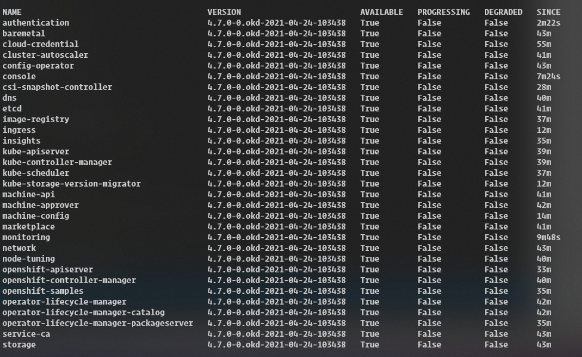

# Working combination (so far)
- Fedora CoreOS 33.20210217.3.0
- OKD 4.7.0-0.okd-2021-04-24-103438
- ESXi 7.0U2
- KVM

### Links for Fedora CoreOS
https://builds.coreos.fedoraproject.org/browser?stream=stable

#### ISO
- Live ISO: fedora-coreos-33.20210217.3.0-live.x86_64.iso https://builds.coreos.fedoraproject.org/prod/streams/stable/builds/33.20210217.3.0/x86_64/fedora-coreos-33.20210217.3.0-live.x86_64.iso

#### PXE
- Live Kernel: fedora-coreos-33.20210217.3.0-live-kernel-x86_64 https://builds.coreos.fedoraproject.org/prod/streams/stable/builds/33.20210217.3.0/x86_64/fedora-coreos-33.20210217.3.0-live-kernel-x86_64
- Live Initramfs: fedora-coreos-33.20210217.3.0-live-initramfs.x86_64.img https://builds.coreos.fedoraproject.org/prod/streams/stable/builds/33.20210217.3.0/x86_64/fedora-coreos-33.20210217.3.0-live-initramfs.x86_64.img
- Live Rootfs: fedora-coreos-33.20210217.3.0-live-rootfs.x86_64.img https://builds.coreos.fedoraproject.org/prod/streams/stable/builds/33.20210217.3.0/x86_64/fedora-coreos-33.20210217.3.0-live-rootfs.x86_64.img

## Get pull request

https://cloud.redhat.com/openshift/install/pull-secret

## master nodes with vmxnet3 driver
```
sudo ethtool -K ens192 tx-udp_tnl-segmentation off
sudo ethtool -K ens192 tx-udp_tnl-csum-segmentation off
```

#### File: `/etc/NetworkManager/dispatcher.d/99-vsphere-disable-tx-udp-tnl`
> Reference: https://github.com/openshift/machine-config-operator/pull/2495/files

Place in all openshift nodes, masters and workers.

```bash
#!/bin/bash
# Workaround:
# https://bugzilla.redhat.com/show_bug.cgi?id=1941714
# https://bugzilla.redhat.com/show_bug.cgi?id=1935539
driver=$(nmcli -t -m tabular -f general.driver dev show "${DEVICE_IFACE}")
if [[ "$2" == "up" && "${driver}" == "vmxnet3" ]]; then
  logger -s "99-vsphere-disable-tx-udp-tnl triggered by ${2} on device ${DEVICE_IFACE}."
  ethtool -K ${DEVICE_IFACE} tx-udp_tnl-segmentation off
  ethtool -K ${DEVICE_IFACE} tx-udp_tnl-csum-segmentation off
fi
```

#### File: `install-config.yaml`

From: `networkType: OpenShiftSDN`

To: `networkType: OVNKubernetes`
```yaml
...
networking:
  clusterNetwork:
  - cidr: 10.128.0.0/14
    hostPrefix: 23
  networkType: OVNKubernetes
  serviceNetwork:
  - 172.30.0.0/16
...
```

## export kubeconfig key
```
export KUBECONFIG=/usr/share/nginx/html/baremetal/auth/kubeconfig
```

## Follow bootstrap progress
```
openshift-install --dir=/usr/share/nginx/html/baremetal/ wait-for bootstrap-complete --log-level=info
```

## Get node
```
oc get nodes
```

## Check for operator status
```
watch -n 5 oc get clusteroperators
```

## CSR operations
### Get CSR
```
oc get csr
```

### Approve CSR
```
oc get csr -o go-template='{{range .items}}{{if not .status}}{{.metadata.name}}{{"\n"}}{{end}}{{end}}' | xargs --no-run-if-empty oc adm certificate approve
```

## Wait for install completion

```
openshift-install --dir=/usr/share/nginx/html/baremetal/ wait-for install-complete
```

## Get kubeadmin password for Console
```
cat /usr/share/nginx/html/baremetal/auth/kubeadmin-password
```

https://console-openshift-console.apps.lab.okd.local/

## Persistent Volume
### NFS
Copy `exports` to `/etc`.

Edit `registry_pv.yaml` to match NFS exported filesystem.

Create the PV:
```
oc create -f registry_pv.yaml
oc get pv
```

Edit image-registry operator:
```
oc edit configs.imageregistry.operator.openshift.io
```
From: `  managementState: Removed`

To: `  managementState: Managed`

From: `  storage: {}`

To:
```yaml
  storage:
    pvc:
      claim:
```


## Other configs
### dnsmasq support for PXE (asuswrt-merlin)

```
dhcp-boot=pxelinux.0,fqdn.host,IP-host
```
Where:

`fqdn.host`: full hostname for the TFTP server

`IP-host`: IP address for the TFTP server

## After ~40 minutes



## Sources

https://itnext.io/guide-installing-an-okd-4-5-cluster-508a2631cbee

https://docs.openshift.com/container-platform/4.7/installing/installing_bare_metal/installing-bare-metal.html

https://github.com/openshift/okd/issues/
